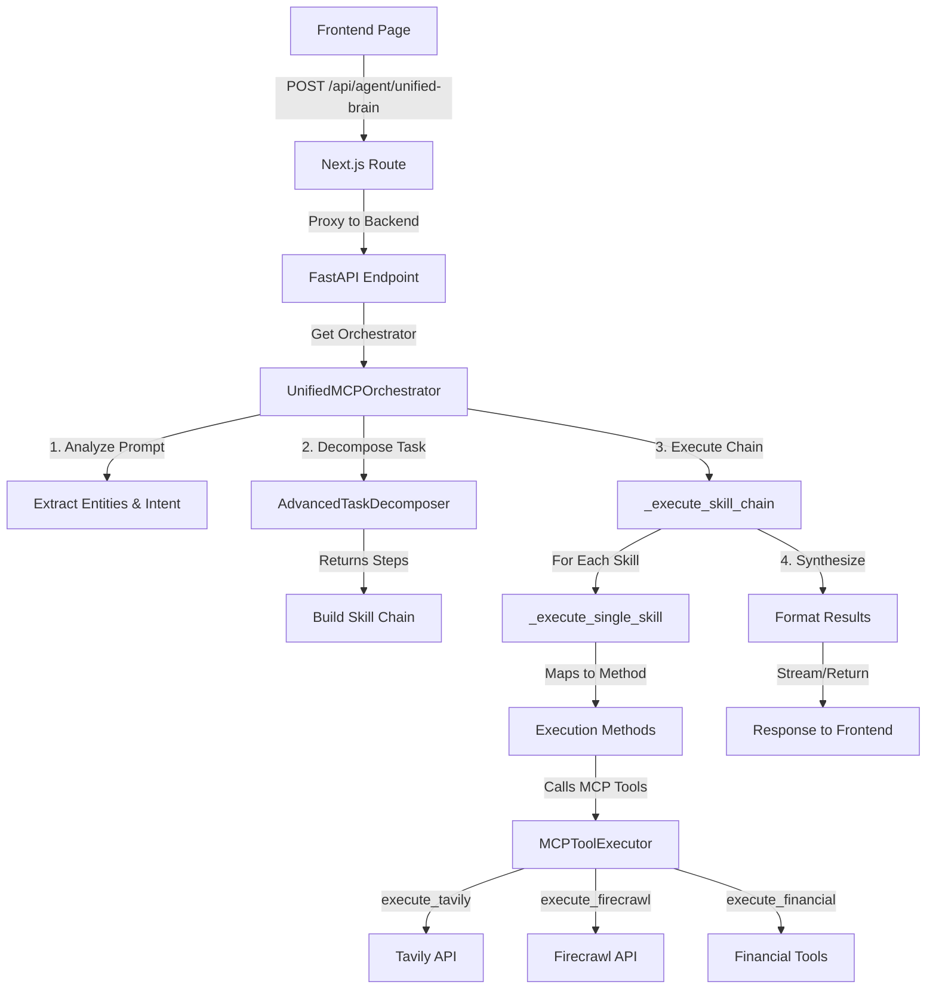
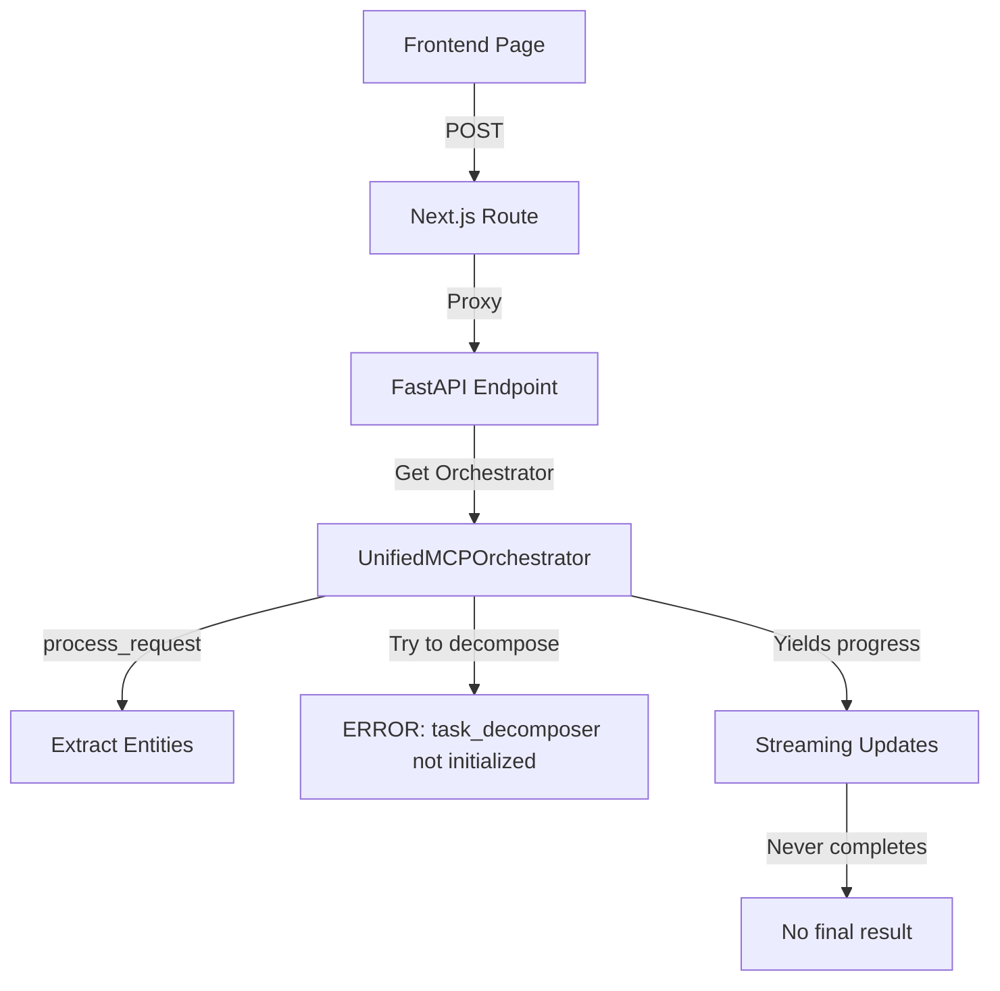

# Complete Data Flow: Frontend → Backend → Skills → Tools

## Current Architecture Status

### ✅ What's Working:
1. **Frontend Pages** (5 total):
   - Matrix page → `/api/agent/unified-brain` (outputFormat: 'matrix')
   - Docs page → `/api/agent/unified-brain` (outputFormat: 'docs')
   - Deck page → `/api/agent/unified-brain` (outputFormat: 'deck')
   - Fund Admin → `/api/agent/unified-brain` (outputFormat: 'analysis')
   - Management Accounts → `/api/agent/unified-brain` (outputFormat: 'spreadsheet')

2. **API Route Proxy**:
   - `/frontend/src/app/api/agent/unified-brain/route.ts` - Proxies to backend

3. **Backend Endpoint**:
   - `/backend/app/api/endpoints/unified_brain.py` - Receives requests
   - Properly registered in `router_fixed.py`

4. **Orchestrator**:
   - `/backend/app/services/unified_mcp_orchestrator.py` - Main orchestrator
   - Has 16 skill execution methods (`_execute_company_fetch`, etc.)
   - Has skill-to-method mapping in `_execute_single_skill`

5. **MCP Tools** (32 implemented):
   - In `mcp_orchestrator.py`: execute_tavily, execute_firecrawl, execute_financial, etc.

### ❌ What's NOT Working:

1. **Task Decomposer Not Imported**:
   ```python
   # Line 287 in unified_mcp_orchestrator.py
   decomposed_task = await self.task_decomposer.decompose(prompt, output_format.value)
   # But task_decomposer is imported as a class, not initialized!
   ```

2. **Skill Chain Not Executing**:
   - Skills are built into a chain but never actually executed
   - The `_execute_skill_chain` method exists but isn't called in `process_request`

3. **No Final Response**:
   - The generator yields progress updates but never the actual result
   - Missing the final skill execution and response synthesis

## The Data Flow (What Should Happen):



## The Actual Flow (What's Happening):



## Critical Issues to Fix:

### 1. Initialize Task Decomposer
```python
# In unified_mcp_orchestrator.py __init__:
from app.services.advanced_task_decomposer import AdvancedTaskDecomposer
self.task_decomposer = AdvancedTaskDecomposer()  # Need instance, not class
```

### 2. Actually Execute the Skill Chain
```python
# In process_request, after building skill_chain:
if stream:
    async for result in self._execute_skill_chain_stream(skill_chain, entities):
        yield result
else:
    result = await self._execute_skill_chain(skill_chain, entities)
    yield result
```

### 3. Return Final Result
```python
# At the end of process_request:
final_result = {
    "type": "complete",
    "task_id": task_id,
    "data": synthesized_data,
    "format": output_format.value
}
yield final_result
```

## What Each Component Should Do:

### Frontend (✅ Working)
- Sends request with prompt and outputFormat
- Handles streaming responses
- Renders results based on format

### API Route (✅ Working)
- Proxies request to backend
- Handles streaming properly
- Returns errors appropriately

### Backend Endpoint (✅ Working)
- Receives request
- Gets orchestrator instance
- Handles streaming/non-streaming

### Orchestrator (⚠️ Partially Working)
- ✅ Has all skill execution methods
- ✅ Has skill-to-method mapping
- ❌ Task decomposer not initialized
- ❌ Skill chain not executed
- ❌ No final result returned

### MCP Tools (✅ Working)
- All 32 tools implemented
- Ready to be called by skills

## Summary:
**The infrastructure is 90% complete**. The main issues are:
1. Task decomposer needs to be an instance, not a class
2. Skill chain needs to be executed after being built
3. Final results need to be yielded back to frontend

These are simple fixes in the orchestrator's `process_request` method.